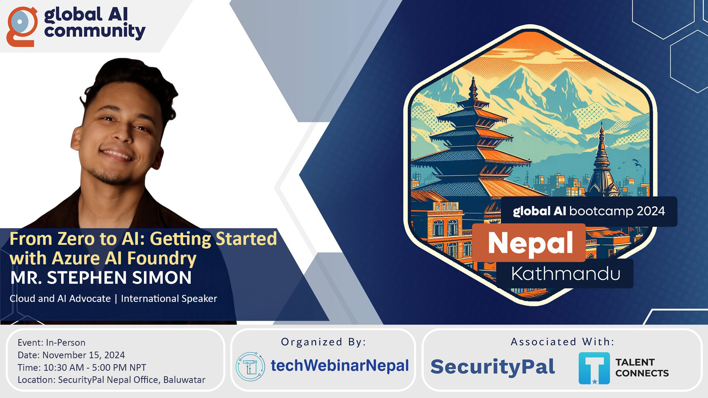

On **November 15, 2024**, I had the opportunity to travel to Nepal and deliver a beginner-friendly session titled:
**“From Zero to AI: Getting Started with Azure AI Foundry.”**

The experience was nothing short of inspiring. The audience was a mix of developers, data enthusiasts, students, and professionals who were curious about how to begin their journey with AI.

## Why This Session?

AI is no longer reserved for researchers in labs or tech giants with massive infrastructure, it’s becoming a **toolkit at everyone’s fingertips**. With platforms like **Azure AI Foundry**, anyone with curiosity and a bit of technical drive can start building solutions that leverage the power of generative AI.

> 👉 **My goal was simple:**  
To break down AI into approachable steps and show how accessible the technology has become.

## What We Covered

The session took participants on a step-by-step journey:

- **Introduction to Azure AI Foundry:** Navigating the platform and understanding its core capabilities.

- **First Steps in AI:** How to set up your workspace and experiment with prebuilt models.

- **Hands-On Generative AI:** Spinning up the first generative AI solution—from idea to prototype.

- **Best Practices for Beginners:** Tips on structuring prompts, managing resources, and learning by doing.

- **Roadmap Ahead:** Guidance on how to go from “trying things out” to building impactful AI-powered applications.

## The Audience Experience

What stood out most to me was the enthusiasm in the room. Many attendees were engaging with AI tools for the first time, and their excitement reminded me of why I love sharing knowledge at events. The questions ranged from:

- “Do I need to know coding to start with Azure AI Foundry?”

- “How do I make sure my AI app is cost-friendly?”

- “Where should I go next after building my first prototype?”

The interactive nature of the session kept the energy high, and by the end, several participants were already experimenting with their first AI workflows.

## Why Nepal Was Special

Delivering this session in Nepal was a truly rewarding experience. The local tech community is **vibrant, fast-growing, and eager to embrace AI**. There’s a hunger to learn and apply these technologies not just in theory, but in practical ways that can impact businesses, education, and society.

## Gratitude

I’m deeply thankful to the organizers for inviting me, and to the community in Nepal for the warm welcome and active participation. It was an honor to introduce **Azure AI Foundry** to many who are just starting their AI journey.

This session reaffirmed something important: **AI isn’t the future, it’s the present. And with the right tools, anyone can be part of it**.