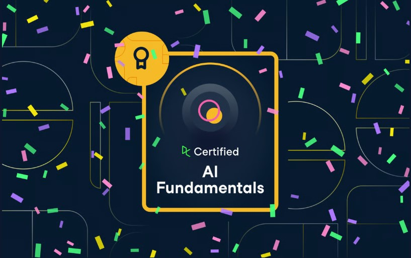
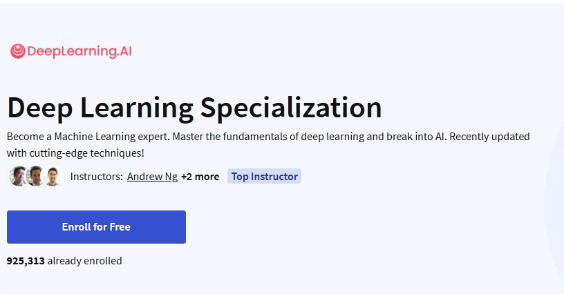
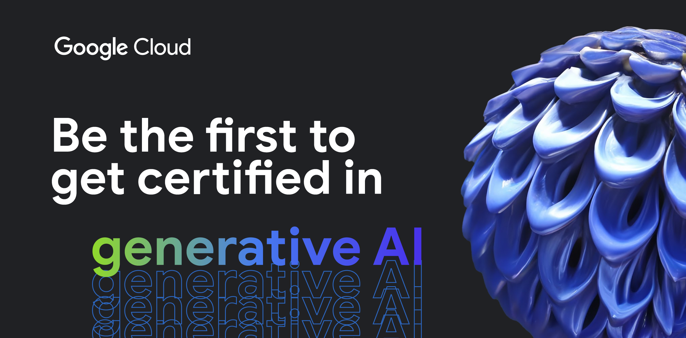
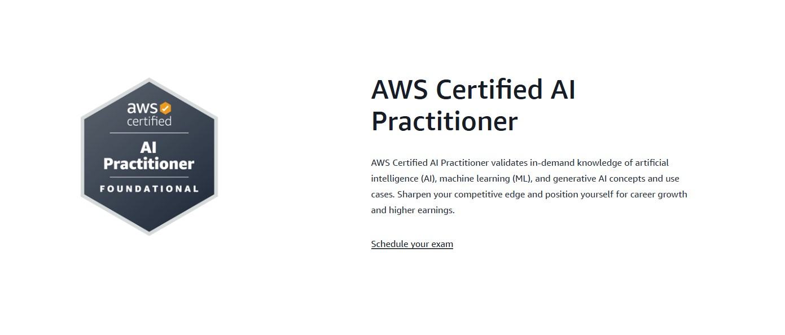
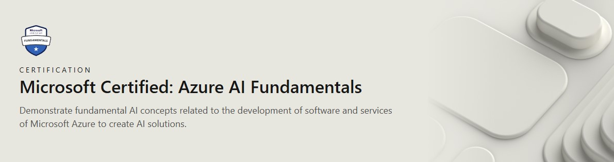

For me, certifications are a powerful answer. They not only solidify your understanding of key concepts but also signal to employers that you're committed to continuous learning and mastery.

I've sifted through many options and compiled my top picks for AI certifications. This list includes a mix of foundational, specialized, and platform-specific credentials that I believe offer immense value, whether you're starting your AI journey or aiming to specialize.

***
### My Top Picks for AI Certifications
Here's a breakdown of each, including what you'll learn, typical costs, and validity periods. (Please note: Costs and details can change, so always check the official certification pages for the most current information.)

## 1. DataCamp’s AI Fundamentals Certification
This certification is designed for professionals who need a solid grasp of AI's business impact without necessarily diving into deep coding. It focuses on conceptual understanding.

Key Topics Covered: 
- Core AI and Machine Learning concepts
- Generative AI, Large Language Models (LLMs) 
- Practical business applications of AI, 
- AI ethics, and responsible AI principles

**Cost:** Included with a DataCamp Premium subscription (around $25 USD/month). The certification typically needs to be completed within 30 days of registration.

**Validity:** This certification is generally considered a foundational, evergreen credential without a strict expiration date, but continuous learning is always recommended.

## 2. Deep Learning Specialization by Andrew Ng (Coursera)
Taught by AI pioneer Andrew Ng, this specialization is widely regarded as a foundational program for anyone serious about deep learning. I personally found his ability to break down complex concepts invaluable.

Key Topics Covered:
- Neural Networks and Deep Learning basics 
- Improving Deep Neural Networks (hyperparameter tuning, regularization, optimization) 
- Structuring Machine Learning Projects (ML strategy) 
- Convolutional Neural Networks (CNNs) for computer vision 
- Sequence Models (RNNs, LSTMs, attention mechanisms) for NLP

**Cost:** Approximately $59 USD per month via Coursera's subscription model. You can often complete it within 4-5 months if you commit 10 hours/week. Financial aid is usually available.

**Validity:** This is a specialization certificate. It doesn't have a formal expiration, but the field evolves quickly, so the knowledge needs continuous updating.

## 3. Generative AI Leader by Google
This is Google's first-of-its-kind certification for non-technical professionals and strategic leaders. It validates your understanding of generative AI's strategic implications. I like that it fills a crucial gap for those driving AI adoption in organizations.

Key Topics Covered:
- Fundamentals of generative AI 
- Google Cloud's generative AI offerings (Vertex AI, Gemini for Workspace) 
- Methods to improve generative AI model output (prompt engineering) 
- Business strategies for successful generative AI solutions 
- Generative AI agents for organizational transformation

**Cost:** The learning materials are often free via Google Cloud Skills Boost. The exam fee is $99 USD (plus applicable taxes).

**Validity:** 3 years. You can renew by taking a renewal exam or the standard exam.

## 4. Machine Learning Engineer by Google (Professional)
This certification is for experienced professionals who design, build, and productionize ML solutions on Google Cloud. It's comprehensive and demands practical experience.

Key Topics Covered
- ML solution architecture and design
- Data preparation and feature engineering 
- ML model development and training (TensorFlow, PyTorch on Vertex AI) 
- ML pipeline automation (MLOps, CI/CD) 
- Model deployment, serving, and monitoring 
- Responsible AI principles

**Cost:** $200 USD

**Validity:** 2 years. Renewal requires passing a recertification exam.

## 5. AWS Certified AI Practitioner (AIF-C01)
Ideal for beginners and those new to AI/ML on AWS. This foundational certification validates your understanding of core AI/ML concepts and how they apply to AWS services. I recommend this as a great entry point into cloud-based AI.

Key Topics Covered:
- Fundamentals of AI and Machine Learning 
- Fundamentals of Generative AI
- Applications of Foundation Models (e.g., Amazon Bedrock) 
- Responsible AI Guidelines 
- Core AWS AI Services (e.g., Amazon SageMaker, Amazon Transcribe, Lex, Polly)

**Cost:** $150 USD.

**Validity:** 3 years. Recertification is required before expiration.

## 6. AWS Certified Machine Learning - Specialty (MLS-C01)
This is an advanced certification for individuals in a development or data science role with at least one year of experience in machine learning/deep learning on AWS. It demonstrates deep expertise.

Key Topics Covered
- Data Engineering for ML 
- Exploratory Data Analysis 
- Modeling (algorithm selection, training, hyperparameter optimization) 
- ML Implementation and Operations (MLOps, deployment, monitoring)

**Cost:** $300 USD.

**Validity:** 3 years. Recertification is required before expiration.

## 7. Microsoft Certified: Azure AI Fundamentals (AI-900)
A great entry-level certification for anyone looking to validate foundational AI and machine learning concepts using Azure services. I find it excellent for understanding cloud AI basics. 

Key Topics Covered
- Common AI workloads and responsible AI principles 
- Fundamental principles of machine learning on Azure
- Features of Computer Vision workloads on Azure 
- Natural Language Processing (NLP) workloads on Azure Conversational AI workloads on Azure 

**Cost:** $99 USD (prices may vary by region, check local pricing for India). 

**Validity:** This certification typically does not expire, making it a valuable foundational credential.

## 8. Microsoft Certified: Azure AI Engineer Associate (AI-102) 
This certification is for AI engineers who design and implement AI solutions on Azure. It requires proficiency in Python or C# and a good understanding of Azures AI portfolio. 

Key Topics Covered
- Plan and manage Azure AI solutions 
- Implement Computer Vision solutions 
- Implement Natural Language Processing solutions
- Implement knowledge mining solutions (Azure AI Search) 
- Implement conversational AI solutions (Azure Bot Service, Azure OpenAI Service for generative AI) 
- Implement generative AI solutions (newly added focus)

**Cost:** $165 USD (prices may vary by region, check local pricing for India). 

**Validity:** 1 year. Certifications can be renewed annually by passing a free online assessment.

***

### My Final Thoughts
Choosing the right certification depends on your current skills, career goals, and the cloud platform you're most interested in. I encourage you to visit the official pages for each certification to get the latest exam guides and resources.

Investing in these certifications is investing in yourself and your future in AI. They demonstrate not just knowledge, but a dedication to mastery in this rapidly evolving field.